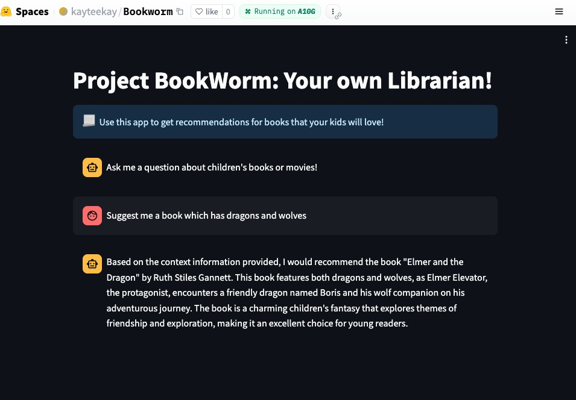

# Project-Bookworm
## Introduction
This project is an attempt to create your own digital librarian that will serve as a go-to to get recommendations for books that you might want to read. This is achieved using Retrieval Augmented Generation(RAG) techniques with open source Large Language Models(LLMs) over digital catalogues for books.

A prototype HuggingFace space can be found [here](https://huggingface.co/spaces/kayteekay/Bookworm) 

## Sample

